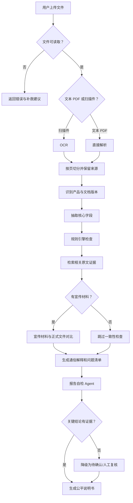
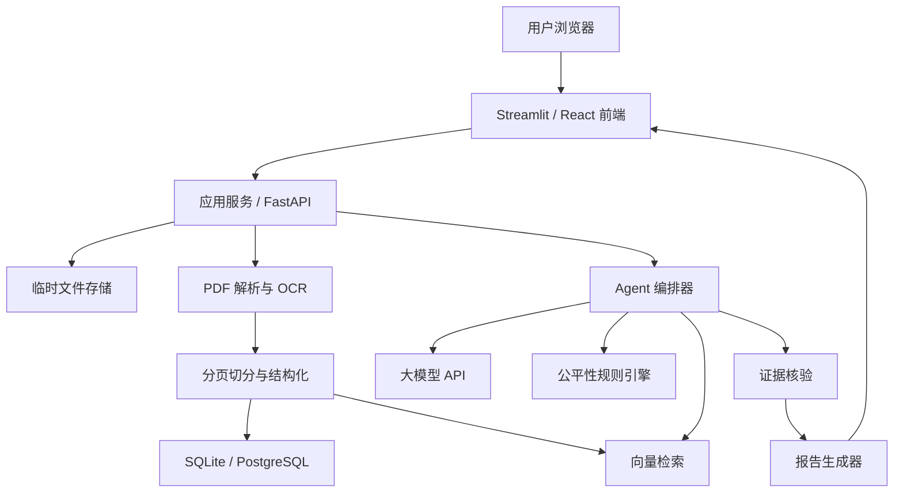

# 金融产品“公平说明书”Agent 项目制作方案

> 文档用途：课程大作业总体设计、团队分工、开发实施、PPT 与 Demo 制作依据  
> 当前版本：V1.0  
> 项目性质：金融科技课程教学项目 / MVP 原型  
> 暂定产品名：**明白金 FinFair**  
> 核心口号：**不替你做决定，只把重要的事讲明白。**

---

## 0. 一页结论

### 0.1 这个项目到底要做什么

**明白金是一款金融产品购买前信息核验 Agent：它将宣传材料与正式说明书逐项对照，把收益、本金、期限、费用和风险翻译成普通用户能理解的说明，并为每个结论提供可追溯证据。**

当前课程 MVP 面向普通金融消费者；金融机构营销材料一致性初审仅作为后续 B2B 延伸方向，不属于当前已经交付或验证的能力。

用户上传金融产品说明书、保险条款、宣传海报或销售话术后，系统自动：

1. 识别产品类型和文件结构；
2. 提取收益、费用、期限、风险、退出条件、免责条款等重要信息；
3. 将复杂术语转换为普通人能理解的语言；
4. 对照正式文件，检查宣传材料是否遗漏、弱化或模糊重要风险；
5. 生成最坏情形说明和“购买前必须确认的问题”；
6. 为每一项重要结论提供原文出处；
7. 输出一份结构清晰、可下载的“公平说明书”。

项目不做收益预测，不推荐具体金融产品，不代替金融机构开展正式适当性评估，也不替用户作出购买决定。

### 0.2 为什么适合作为课程大作业

- 需求真实：普通用户普遍难以理解长篇金融条款。
- 有金融专业性：涉及风险、费用、期限、流动性、免责、信息披露和适当性。
- 有 Agent 特征：需要完成文件识别、信息抽取、规则检查、交叉核验、解释生成和报告输出等多步骤任务。
- 有产品闭环：上传材料到获得报告的完整流程可以实际演示。
- 有创新性：重点不是“推荐什么产品”，而是“检查产品是否被讲明白”。
- 有社会价值：帮助消费者降低因信息不对称产生的误解。
- 有商业延伸设想：当前服务消费者，未来可探索银行、保险、财富管理和消保审查场景，但本项目不宣称机构需求已经得到验证。
- Demo 效果好：可以直观展示宣传海报与正式条款之间的信息差异。

### 0.3 最小可行产品 MVP

在课程周期内，至少完成：

- 支持上传 1 份 PDF 产品说明书；
- 可选上传 1 张宣传海报或 1 段销售文案；
- 自动识别并提取 8 类核心信息；
- 输出通俗解释、风险清单和购买前问题；
- 每条关键结论显示原文引用及页码；
- 对宣传材料和正式文件进行一致性检查；
- 生成网页报告，并支持下载 Markdown 或 PDF；
- 使用一套模拟产品材料完成完整 Demo；
- 形成 GitHub 仓库、商业路演 PPT 和 Demo 视频。

---

## 1. 老师要求的拆解

### 1.1 老师明确提出的要求

根据课程项目图片，老师明确提出：

1. 提交 GitHub 项目库；
2. 提交 PPT 商业计划书；
3. 提交 Demo 视频；
4. 以创业团队视角向投资人和用户证明项目；
5. 重视团队合作；
6. 判断需求是否真实、市场是否有前景；
7. 思考如何触达用户和完成用户转化；
8. 重视产品可用性与先进性。

以上内容是当前已经掌握的明确要求。

### 1.2 从老师提供的视频中得到的项目标准

以下是根据三个参考视频作出的分析，不应当表述成老师逐字宣布的硬性规定：

- 产品需要能够实际运行，不能只有概念或 PPT；
- 可以使用 n8n、大模型 API、数据库和第三方 API 快速搭建；
- Agent 应当形成多步骤工作流，而不是只有一次对话；
- 产品开发之后还要考虑第一批用户、推广渠道和商业化；
- 好的项目需要完成“输入—处理—结果—用户价值”的闭环；
- 早期项目应该控制成本，先验证核心需求；
- 项目展示时要能够说明产品、技术、用户、营销与增长。

### 1.3 尚未确认的作业信息

目前材料没有明确以下事项，团队应向老师或助教确认：

- 最终提交日期和具体时间；
- 小组人数限制；
- PPT 页数及汇报时长；
- Demo 视频最长时长；
- 是否需要单独提交 Word 版商业计划书；
- GitHub 是否必须公开；
- 是否要求在线部署；
- 是否允许使用付费 API；
- 评分标准及各部分权重；
- 是否需要现场演示；
- 每位成员是否都必须参加答辩；
- 文件命名和提交平台要求。

在这些问题得到确认前，本方案采用以下工作假设：

- PPT 控制在 10—12 页；
- 路演控制在 6—8 分钟；
- Demo 视频控制在 3—5 分钟；
- GitHub 使用公开仓库，但不上传密钥和敏感数据；
- 产品至少能够在本地运行，争取提供在线体验地址；
- 商业计划内容整合进路演 PPT，必要时再扩展成 Word 文档。

---

## 2. 项目定位

### 2.1 项目名称

正式名称建议：

**明白金 FinFair——金融产品公平说明书 Agent**

备选名称：

- 看懂再买
- 金融条款显微镜
- FinClear
- 风险说人话

### 2.2 一句话价值主张

明白金是一款金融产品购买前信息核验 Agent：它将宣传材料与正式说明书逐项对照，把收益、本金、期限、费用和风险翻译成普通用户能理解的说明，并为每个结论提供可追溯证据。

### 2.3 核心问题

普通消费者购买理财、保险等产品时，经常面临：

- 文件太长，不知道重点在哪里；
- 术语专业，难以理解实际含义；
- 宣传材料突出收益，风险说明不够醒目；
- 不清楚提前退出、费用扣除和最坏结果；
- 销售话术与正式合同可能存在差异；
- 找不到免责、除外责任或特殊限制；
- 无法判断还有哪些问题必须向销售人员确认。

这些问题本质上属于金融产品提供方与消费者之间的信息不对称。

### 2.4 目标用户

#### 首要用户：普通金融消费者

- 第一次购买理财或保险的人；
- 金融知识较少的消费者；
- 需要替父母核对金融产品的年轻人；
- 希望快速了解复杂产品文件的人。

#### 后续延伸用户：金融机构内部人员（当前 MVP 未实现）

- 消费者权益保护人员；
- 产品合规初审人员；
- 营销材料审核人员；
- 客户经理和保险销售培训人员；
- 客服及投诉处理人员。

上述机构场景是未来 B2B 产品方向，不应在本期展示中描述为现有客户、已验证需求或已交付功能。

### 2.5 初期聚焦范围

MVP 建议只选择一种金融产品类型，优先顺序为：

1. 银行理财产品说明书；
2. 储蓄型或健康保险条款；
3. 消费贷产品说明；
4. 基金产品资料概要。

**推荐 MVP 首先支持银行理财产品。**

原因：

- 说明书结构相对规范；
- 收益、风险、期限、费用和赎回条件比较清晰；
- 容易制作模拟材料；
- 适合展示宣传文案与正式说明书的差异；
- 不需要处理复杂的医疗或事故证明。

### 2.6 明确不做什么

第一版明确排除：

- 不预测收益率和市场涨跌；
- 不推荐买入、卖出或持有具体产品；
- 不给出“适合买/不适合买”的确定结论；
- 不替代金融机构正式风险测评；
- 不承诺文件中没有其他风险；
- 不自动办理购买、赎回或理赔；
- 不连接真实银行账户；
- 不采集身份证号、银行卡号等真实敏感信息；
- 不把模型输出作为法律、合规或投资意见；
- 不在未经授权的情况下处理真实客户材料。

---

## 3. 需求验证方案

由于项目制作时间不足一天，本项目不再安排大规模访谈或问卷。需求依据改为“已有研究与监管材料”，当天只做最小可用性冒烟测试。这样能节省时间，同时避免把来不及完成的小样本调查包装成市场验证。

### 3.1 已有研究能够支持的判断

| 编号 | 可获得的证据 | 对本项目的含义 | 证据状态 |
|---|---|---|---|
| E1 | SEC 关于披露简化和 Plain English 的材料指出，披露只有在可理解、完整、及时的情况下才可能有效，并主张用通俗语言、关键信息摘要和术语表提升个人投资者理解 | “把专业文件转换为分层、通俗的说明书”具有明确的信息披露价值 | 有权威材料支持 |
| E2 | SEC 的投资者金融素养研究显示，投资者偏好摘要式、分层式披露，即先展示核心信息，再允许查看更详细内容 | 产品报告应采用“30 秒结论—通俗解释—原文证据”的三层结构 | 有权威研究支持 |
| E3 | 有关金融披露可读性的实验研究发现，简单语言有助于改善理解和金融决策任务体验；有关基金费用术语的研究也发现，通俗表达能够提高费用理解 | 收益、风险、费用、期限和退出条件应使用普通语言解释，而不是直接复制条款 | 有论文支持，但效果受具体材料和人群影响 |
| E4 | OECD 金融消费者风险研究指出，披露对于展示产品复杂性、风险、成本和适当性很重要，但仅靠披露不足以克服行为偏差、低金融素养和利益冲突 | 产品不能声称“一份报告就能消除误导”，还需要最坏情形、购买前问题和人工核对 | 有国际组织材料支持 |
| E5 | 金融 AI 可解释性研究表明，解释的质量、完整性、准确性和有用性会影响用户对金融 AI 的评价与采用；实验研究也发现解释会在一定条件下影响信任和付费意愿 | Agent 不能只给结论，必须提供出处、原文和不确定性标记 | 有研究支持，但“页码引用一定提升本产品信任”仍需后续验证 |
| E6 | 《金融机构产品适当性管理办法》强调了解产品、了解客户、风险评级、风险承受能力评估、充分告知和风险提示 | 项目应聚焦产品信息解释和风险披露，不应越界替用户做购买决定 | 有现行监管依据支持 |

### 3.2 现有资料无法证明的项目限制

课程时间不足以开展有代表性的市场调查；现有文献也不能替代本产品自身的商业验证。因此，下列事项不再列为本期必须完成的“待验证任务”，而是在报告和答辩中作为项目限制披露：

| 编号 | 现有证据不能支持的结论 | 本项目的表达边界 |
|---|---|---|
| L1 | 中国消费者普遍愿意主动上传金融产品文件 | 不给出使用意愿比例，不宣称已形成真实用户需求 |
| L2 | 用户愿意为个人版报告付费 | 仅将收费功能视为商业设想，不预测转化率和收入 |
| L3 | 金融机构愿意采购营销材料初审工具 | 仅作为未来 B2B 方向，不声称已有客户或采购意向 |
| L4 | 对照核验一定比普通摘要更受欢迎 | 只展示两者功能差异，不推导用户偏好 |
| L5 | 页码引用会显著提高用户信任 | 只将引用视为可追溯和防幻觉机制，不虚构信任提升幅度 |

若没有能够直接支持上述结论的现成研究，本项目不额外编造验证结果，也不把临时、极小样本反馈外推为市场结论。

### 3.3 本期验证范围：只验证产品能否正确运行

本期测试聚焦可重复验证的功能事实：

1. 模拟 PDF 能否被解析并保留正确页码；
2. 收益、本金、期限、费用、赎回和风险等字段能否被提取；
3. 宣传文案与正式说明书的不一致能否被识别；
4. 报告中的逐字引文能否在对应页面找到；
5. 未配置 API 或模型失败时，规则模式能否继续生成结果；
6. Markdown、JSON、Word 和 PDF 能否正常导出。

这些测试只能证明当前样例和测试条件下的功能表现，不能证明市场需求、付费意愿、用户转化或机构采购。

### 3.4 PPT 可直接使用的证据表达

可以写：

> 既有监管材料和研究表明，金融披露需要具备可理解性、完整性和及时性；个人投资者偏好摘要式、分层式披露。基于此，我们设计了“结论—通俗解释—原文证据”三层公平说明结构。

不可以写：

> 调研证明大多数用户愿意使用并付费。

### 3.5 参考研究与材料

1. U.S. Securities and Exchange Commission, *Report of the Task Force on Disclosure Simplification*：<https://www.sec.gov/news/studies/smpl.htm>
2. U.S. Securities and Exchange Commission, *Plain English Disclosure*：<https://www.sec.gov/rules-regulations/1998/01/plain-english-disclosure>
3. U.S. Securities and Exchange Commission, *Study Regarding Financial Literacy Among Investors*：<https://www.sec.gov/file/917-financial-literacy-study-part1pdf>
4. OECD, *Consumer Finance Risk Monitor 2026 — Conduct-related risks*：<https://www.oecd.org/en/publications/consumer-finance-risk-monitor-2026_61f7dbe0-en/full-report/conduct-related-risks_3038e5f7.html>
5. Ben David, Resheff & Tron, *Explainable AI and Adoption of Financial Algorithmic Advisors: an Experimental Study*：<https://arxiv.org/abs/2101.02555>
6. *Does the ease of reading of financial disclosures influence investment decision?*：<https://www.sciencedirect.com/science/article/pii/S0165176521001609>
7. 国家金融监督管理总局，《金融机构产品适当性管理办法》：<https://www.nfra.gov.cn/cn/view/pages/ItemDetail.html?docId=1217123&itemId=917>

引用这些研究只能证明“问题和设计原则有依据”，不能替代本产品自身的准确性测试、用户测试或商业验证。

---

## 4. 产品功能设计

### 4.1 核心用户流程


### 4.2 MVP 必做功能

#### F1. 文件上传与校验

- 上传 PDF；
- 显示文件名、页数和大小；
- 检查是否加密或无法读取；
- 提醒用户不要上传身份证、银行卡等敏感信息；
- 允许删除已上传文件；
- 限制文件类型和大小。

#### F2. 文档解析

- 提取 PDF 文本；
- 保留页码；
- 对扫描件调用 OCR；
- 识别标题和章节；
- 对过长文件进行分块；
- 记录每个文本块的来源页码。

#### F3. 产品类型识别

识别：

- 产品名称；
- 产品发行方；
- 产品类型；
- 文件版本或日期；
- 适用对象；
- 币种；
- 产品期限。

识别不确定时必须显示“待确认”，不能自行补全。

#### F4. 八类核心信息提取

1. 产品是什么；
2. 收益来源和收益不确定性；
3. 本金可能面临什么风险；
4. 产品期限与资金锁定；
5. 申购、赎回和提前退出条件；
6. 各类费用；
7. 主要风险和最不利情形；
8. 其他重要限制、免责或特殊条款。

#### F5. 通俗解释

每项信息采用三层表达：

- 一句话结论；
- 通俗解释；
- 原文引用。

示例：

> 一句话结论：这不是保本产品，本金可能发生损失。  
> 通俗解释：如果底层资产表现不佳，你最终拿回的钱可能少于投入金额。  
> 原文出处：产品说明书第 4 页“本产品不保证本金及收益……”。

#### F6. 最坏情形说明

使用明确但不过度恐吓的方式说明：

- 是否可能损失本金；
- 是否可能无法及时赎回；
- 是否存在净值波动；
- 提前退出可能付出的成本；
- 哪些结果无法从当前材料中确定。

不能虚构损失比例。文件没有给出具体数字时，只能说明风险类型。

#### F7. 宣传材料一致性检查

对比宣传海报/销售文案与正式说明书：

- 宣传说法是否有正式文件依据；
- 是否只强调收益、弱化风险；
- 是否遗漏期限或资金锁定；
- 是否遗漏费用；
- 是否使用“稳赚”“保本”“零风险”等绝对化表达；
- 是否遗漏最不利结果；
- 宣传数字与正式文件是否一致；
- 有冲突时并列展示双方原文。

#### F8. 购买前问题清单

自动生成 5—10 个需要用户向销售人员或机构确认的问题，例如：

- 这款产品是否承诺本金安全？
- 在什么情况下我无法按时赎回？
- 除了页面展示的费用，还有哪些费用？
- 展示的业绩比较基准是否等于实际收益？
- 如果提前退出，可能损失什么？

#### F9. 证据追溯

每个关键结论必须能够：

- 显示来源文件；
- 显示页码；
- 显示对应原文；
- 区分“原文事实”和“模型解释”；
- 对低置信度结果标记“请人工核对”。

#### F10. 报告生成

报告至少包含：

- 产品身份卡；
- 30 秒看懂产品；
- 收益与风险；
- 期限与流动性；
- 费用；
- 最坏情形；
- 宣传材料一致性；
- 购买前问题；
- 原文引用；
- 免责声明和人工复核提示。

### 4.3 加分功能

时间充足时选择 1—3 项，不要全部堆叠：

- 语音播报和适老化大字模式；
- 多份产品横向对比；
- 风险提示热力图；
- 宣传海报视觉显著性检查；
- 支持保险条款；
- 报告中英文切换；
- 消保人员审核工作台；
- 人工修改后重新导出；
- 历史报告管理；
- 规则版本与模型版本记录；
- “结论—证据”关系图；
- 用户反馈和错误报告按钮。

### 4.4 页面设计

建议至少完成 5 个页面/状态：

1. **首页**：一句话价值、使用方法、示例报告；
2. **上传页**：文件上传、隐私提醒、示例材料；
3. **分析进度页**：显示 Agent 当前步骤；
4. **报告页**：公平说明书主体；
5. **证据弹窗/抽屉**：显示原文与页码。

报告页建议按以下顺序：

```text
产品身份卡
→ 30秒结论
→ 你可能获得什么
→ 你可能失去什么
→ 钱什么时候能取
→ 要支付哪些费用
→ 宣传与正式文件有何差异
→ 购买前必须问什么
→ 原文证据
→ 局限与免责声明
```

---

## 5. Agent 工作流设计

### 5.1 为什么它是 Agent 而不只是聊天机器人

系统需要根据文件状态和中间结果选择下一步：

- 判断 PDF 是文本版还是扫描版；
- 根据产品类型选择抽取模板；
- 调用 OCR、文档解析、检索和规则检查工具；
- 对关键字段进行交叉核验；
- 发现冲突时生成待确认项；
- 生成报告后执行自检；
- 证据不足时拒绝输出确定结论。

### 5.2 推荐工作流



### 5.3 Agent 模块划分

#### Agent A：文档管理员

职责：

- 检查文件格式；
- 判断是否需要 OCR；
- 切分文件；
- 保留页码和版本。

#### Agent B：产品分析员

职责：

- 识别产品类型；
- 提取结构化字段；
- 汇总收益、风险、期限、费用和退出条件。

#### Agent C：公平性审查员

职责：

- 对比宣传材料与正式文件；
- 检查重大风险是否遗漏；
- 标记疑似误导、绝对化或不完整表达。

#### Agent D：消费者翻译员

职责：

- 将专业术语转换为通俗表达；
- 生成购买前问题；
- 避免形成投资推荐。

#### Agent E：证据核验员

职责：

- 检查关键结论是否有原文支持；
- 检查数字、单位、期限和条件是否一致；
- 将无法确认的内容降级为待确认。

MVP 可以在代码中实现为一个编排器调用多个步骤，不要求真的运行五个独立大模型实例。PPT 中应诚实说明实现方式。

---

## 6. 信息抽取与数据结构

### 6.1 核心字段

```json
{
  "document": {
    "file_name": "",
    "document_type": "",
    "version_date": "",
    "page_count": 0
  },
  "product": {
    "name": "",
    "issuer": "",
    "product_type": "",
    "currency": "",
    "term": "",
    "target_customer_text": ""
  },
  "return": {
    "return_description": "",
    "benchmark": "",
    "guaranteed": false,
    "uncertainties": []
  },
  "risk": {
    "principal_loss_possible": null,
    "risk_level": "",
    "major_risks": [],
    "worst_case_text": ""
  },
  "liquidity": {
    "subscription_period": "",
    "redemption_rules": "",
    "lockup": "",
    "early_exit": ""
  },
  "fees": [
    {
      "name": "",
      "rate_or_amount": "",
      "condition": ""
    }
  ],
  "conflicts": [],
  "open_questions": [],
  "citations": []
}
```

### 6.2 引用对象

```json
{
  "claim_id": "C-001",
  "claim": "该产品不保证本金安全",
  "source_file": "模拟理财产品说明书.pdf",
  "page": 4,
  "source_text": "本产品为非保本浮动收益型产品……",
  "confidence": 0.96,
  "status": "supported"
}
```

### 6.3 结论状态

每条关键结论只能使用以下状态：

- `supported`：原文明确支持；
- `partially_supported`：原文只支持部分内容；
- `conflicting`：不同材料存在冲突；
- `not_found`：当前材料中未找到；
- `needs_review`：解析或语义存在不确定性。

禁止用模型常识把 `not_found` 自动补成确定答案。

---

## 7. 公平性检查规则

### 7.1 基础规则

| 规则编号 | 检查内容 | 典型问题 |
|---|---|---|
| R01 | 保本与本金风险 | 宣传暗示保本，说明书明确不保本 |
| R02 | 收益表达 | 将业绩比较基准表述为预期必得收益 |
| R03 | 风险显著性 | 收益醒目、风险隐藏在小字或后页 |
| R04 | 产品期限 | 宣传未说明资金锁定期 |
| R05 | 退出条件 | 宣传未说明无法提前赎回或赎回限制 |
| R06 | 费用完整性 | 宣传遗漏管理费、销售费等 |
| R07 | 数字一致性 | 宣传数字与正式文件不同 |
| R08 | 绝对化用语 | 出现“稳赚”“零风险”“百分百”等 |
| R09 | 适用对象 | 对目标用户和限制条件说明不足 |
| R10 | 最不利结果 | 未说明本金损失、流动性等最坏情形 |
| R11 | 文件版本 | 宣传引用了过期或无法确认的版本 |
| R12 | 证据缺失 | 重要说法无法在正式文件中找到 |

### 7.2 风险分级

- **红色**：材料明确冲突、疑似严重误导或关键风险被反向表述；
- **橙色**：重大信息遗漏，可能显著影响理解；
- **黄色**：表达不清、条件不完整，需要确认；
- **蓝色**：一般性信息提醒；
- **灰色**：系统无法确认，需要人工复核。

风险等级仅表示“信息表达和材料一致性风险”，不能等同于产品官方风险等级。

### 7.3 规则与大模型的边界

规则引擎负责：

- 数字一致性；
- 关键词和绝对化用语；
- 是否缺少字段；
- 文件版本；
- 固定条件检查。

大模型负责：

- 语义理解；
- 通俗改写；
- 条款之间的逻辑关系；
- 宣传表达与正式文本的语义差异；
- 生成购买前问题。

最终重要结论必须经过证据核验步骤，不能直接采用生成模型第一次输出。

---

## 8. 技术实现思路

### 8.1 推荐技术路线

#### 方案 A：Python 快速开发

- 前端与应用：Streamlit；
- 后端：Python；
- PDF 文本：PyMuPDF；
- OCR：PaddleOCR 或云 OCR；
- 数据验证：Pydantic；
- 向量检索：FAISS/Chroma；
- 大模型：DeepSeek、通义千问或其他可用 API；
- 报告：HTML + WeasyPrint/浏览器打印；
- 数据库：SQLite；
- 部署：Streamlit Community Cloud、Render 或本地演示。

优点：开发快、适合课程项目。  
缺点：界面定制能力一般。

#### 方案 B：前后端分离

- 前端：React/Next.js；
- 后端：FastAPI；
- 数据库：PostgreSQL/Supabase；
- 文件存储：本地或对象存储；
- Agent 编排：LangGraph 或自建状态机；
- 部署：Vercel + Render/Railway。

优点：产品感强。  
缺点：开发量较大。

#### 推荐选择

如果团队开发时间不超过一周，优先选择方案 A。  
如果团队已有成熟前端和后端开发成员，可以选择方案 B。

### 8.2 n8n 是否需要

n8n 不是必需的。可以用于：

- 接收分析任务；
- 调用 OCR 和大模型；
- 生成报告后发送通知；
- 保存用户反馈；
- 定时执行测试。

但是核心报告页面仍建议使用 Streamlit 或 Web 前端，否则产品体验容易停留在工作流演示层面。

### 8.3 系统架构



### 8.4 建议的代码模块

```text
app/
├── ui/
│   ├── home.py
│   ├── upload.py
│   └── report.py
├── parsers/
│   ├── pdf_parser.py
│   ├── ocr_parser.py
│   └── image_parser.py
├── agents/
│   ├── orchestrator.py
│   ├── product_extractor.py
│   ├── fairness_reviewer.py
│   ├── plain_language_writer.py
│   └── evidence_verifier.py
├── rules/
│   ├── disclosure_rules.py
│   ├── marketing_rules.py
│   └── rule_catalog.yaml
├── retrieval/
│   ├── chunker.py
│   └── retriever.py
├── schemas/
│   ├── product.py
│   ├── citation.py
│   └── report.py
├── reports/
│   ├── renderer.py
│   └── templates/
├── tests/
└── main.py
```

### 8.5 密钥与配置

- API Key 写入 `.env`；
- GitHub 只提交 `.env.example`；
- `.gitignore` 排除 `.env`、上传文件、缓存、数据库和日志；
- Demo 视频中遮挡密钥；
- 后端日志不能记录完整敏感文件；
- 设置文件自动删除机制；
- 使用模拟或脱敏材料演示。

---

## 9. 提示词与防幻觉设计

### 9.1 抽取提示词原则

提示词必须要求模型：

- 只根据提供的文件回答；
- 返回固定 JSON；
- 每个字段附页码和原文；
- 找不到时返回 `null`；
- 不利用常识猜测产品信息；
- 冲突时保留双方说法；
- 区分产品官方风险等级与系统提示等级。

### 9.2 通俗解释提示词原则

- 保留原意；
- 不承诺收益；
- 不弱化风险；
- 不扩大原文没有说明的风险；
- 避免使用投资建议语气；
- 每段控制长度；
- 为专业词提供一句解释；
- 明确标注“模型解释”。

### 9.3 报告自检问题

报告生成后，核验 Agent 必须检查：

1. 每条关键结论是否有引用？
2. 引用页码是否存在？
3. 数字是否与原文一致？
4. 百分比的含义是否被改变？
5. “业绩比较基准”是否被误写成实际收益？
6. 是否把“可能”改写成“一定”？
7. 是否产生购买建议？
8. 是否遗漏重大风险？
9. 宣传材料和正式文件冲突是否被保留？
10. 是否出现无法验证的监管或法律结论？

---

## 10. 测试与评价

### 10.1 测试材料

至少制作三套不含真实个人信息的测试材料：

#### Case A：标准材料

- 正式说明书结构完整；
- 宣传材料与说明书一致；
- 用于测试基础抽取和解释。

#### Case B：信息遗漏

- 宣传突出收益；
- 未突出本金风险、费用或锁定期；
- 用于测试公平性检查。

#### Case C：材料冲突

- 宣传数字与说明书不同；
- 文件版本不同；
- 用于测试冲突处理和人工复核。

### 10.2 功能测试

| 测试项 | 通过标准 |
|---|---|
| PDF 上传 | 合法文件可上传，错误格式有明确提示 |
| 文本抽取 | 主要段落与页码正确 |
| OCR | 扫描件核心字段可识别 |
| 字段抽取 | 8 类核心信息均有值或明确显示未找到 |
| 引用 | 关键结论可定位原文 |
| 一致性检查 | 预设冲突能够被发现 |
| 报告 | 页面无明显错位，可下载 |
| 隐私提示 | 上传前可见 |
| 异常处理 | API 失败时不显示伪造结果 |

### 10.3 准确性评估

由团队人工制作“标准答案表”，逐项比较：

- 字段抽取准确率；
- 关键风险召回率；
- 数字一致率；
- 页码引用准确率；
- 冲突识别准确率；
- 无依据结论数量；
- 通俗解释可理解度。

不要只报告一个笼统“准确率”。建议至少展示：

```text
核心字段准确率
关键风险召回率
引用页码准确率
无依据结论率
用户理解度评分
```

### 10.4 用户体验测试

时间允许时邀请 1—2 名未参与开发的同学完成：

1. 上传文件；
2. 找到产品是否保本；
3. 找到提前退出条件；
4. 查看一条结论的原文；
5. 找到宣传材料与正式文件的差异；
6. 下载报告。

记录：

- 是否能独立完成；
- 完成时间；
- 卡住的位置；
- 最有用的模块；
- 不信任的内容；
- 改进建议。

### 10.5 成功指标

课程 MVP 可以设置以下目标，但必须用真实测试验证后才能在 PPT 中表述为结果：

- 关键字段抽取准确率达到 85% 以上；
- 关键引用页码准确率达到 90% 以上；
- 预设重大冲突召回率达到 90% 以上；
- 自动化测试和团队走查能够定位“是否保本、退出条件、费用和原文引用”；该结果只说明功能可运行，不外推为用户需求或偏好；
- 报告中无依据的确定性结论为 0；
- 单份示例文件分析时间控制在 2 分钟内。

以上是项目目标，不是当前已经实现的事实。

---

## 11. 金融、模型与数据风险

### 11.1 风险控制表

| 风险 | 可能影响 | 控制措施 | 责任人 |
|---|---|---|---|
| 模型幻觉 | 产生原文不存在的结论 | 强制引用、JSON 校验、二次核验 | AI/后端 |
| 引用错页 | 用户无法核对 | 分页解析、引用回放测试 | 后端 |
| OCR 错误 | 数字和条款识别错误 | 低置信度标记、人工复核 | 后端 |
| 投资建议越界 | 用户误以为系统推荐购买 | 非目标约束、提示词限制、免责声明 | 产品/合规 |
| 隐私泄露 | 上传材料包含个人信息 | 上传提醒、脱敏、临时存储、自动删除 | 后端 |
| 材料版本冲突 | 使用过期文件形成错误解释 | 识别版本、并列展示、禁止静默选择 | Agent |
| 规则过时 | 审查逻辑与要求不一致 | 规则版本记录、人工更新 | 产品/合规 |
| 过度信任 AI | 用户直接依赖报告决策 | 显示局限、原文入口、人工咨询提示 | 产品 |
| API 不稳定 | Demo 失败 | 缓存示例报告、错误提示、备用模型 | 技术负责人 |
| 成本失控 | 长文档调用费用过高 | 文本分块、缓存、限制页数 | 技术负责人 |

### 11.2 人机边界

涉及用户权益和财务影响时：

- AI 只提供信息整理和辅助解释；
- 用户应核对正式文件；
- 重要争议由人工处理；
- 系统不作最终购买或合规决定；
- 低置信度、冲突和材料缺失必须进入人工复核。

### 11.3 免责声明建议

> 本工具仅用于金融产品信息整理、通俗解释和材料一致性辅助检查，不构成投资建议、保险建议、法律意见或金融机构正式适当性评估。模型可能产生遗漏或错误，请以金融机构提供的正式文件为准，并在作出决定前向持牌机构或专业人员核实。

### 11.4 参考制度背景

项目背景可参考：

- 国家金融监督管理总局《金融机构产品适当性管理办法》，自 2026 年 2 月 1 日起施行；
- 中国人民银行《金融消费者权益保护实施办法》；
- 国家金融监督管理总局有关金融机构人工智能应用透明度、可解释性、公平性、人工复核和个人信息保护的要求。

正式 PPT 引用时应再次核对发布机构、文件名称、版本、发布日期和生效日期，不把课程项目分析写成法律意见。

参考链接：

- <https://www.nfra.gov.cn/cn/view/pages/ItemDetail.html?docId=1217123&itemId=917>
- <https://www.pbc.gov.cn/zhengwugongkai/attachDir/2025/11/2025111914422147275.pdf>
- <https://www.nfra.gov.cn/cn/view/pages/governmentDetail.html?docId=1261784&generaltype=1&itemId=>

---

## 12. 商业模式设想（尚未由本项目验证）

本节用于展示创业团队对未来路径的思考，不代表已经取得用户付费、转化数据、机构客户或采购意向。当前已交付产品仍是面向普通金融消费者的课程 MVP。

### 12.1 当前方向：B2C 功能分层设想

免费版：

- 每月有限次数；
- 支持单份文件；
- 提供基础公平说明卡。

个人付费版：

- 支持更长文件；
- 多产品对比；
- PDF 报告；
- 历史记录；
- 适老语音解释。

### 12.2 后续方向：B2B 延伸设想

面向金融机构：

- 营销材料初审；
- 产品说明通俗化；
- 消保培训；
- 客诉材料辅助整理；
- 私有化部署；
- API 接入；
- 审计日志与规则管理。

### 12.3 潜在触达渠道（未验证）

低成本验证渠道：

- 校园金融教育活动；
- 投资者教育或消费者权益保护活动；
- 后续可安排银行/保险从业者访谈（不列入当天 MVP）；
- 小红书、B站等平台的金融科普内容；
- 保险、理财相关社群；
- 与高校金融社团合作；
- 邀请用户上传公开产品材料进行体验。

### 12.4 假设性用户转化路径（未验证）

```text
科普内容或案例
→ 免费生成一张公平说明卡
→ 发现原本忽略的重要条件
→ 注册保存报告
→ 使用多文件对比或高级报告
→ 个人订阅 / 机构采购
```

### 12.5 竞争分析框架

不要只写“市场上没有竞品”。应当比较：

| 替代方案 | 优点 | 缺点 | 本项目差异 |
|---|---|---|---|
| 自己阅读说明书 | 权威、免费 | 耗时、难理解 | 自动提取与通俗解释 |
| 询问销售人员 | 方便 | 立场可能不完全中立 | 以正式文件为证据 |
| 通用大模型 | 灵活 | 可能无引用、产生幻觉 | 固定流程、规则与证据核验 |
| 金融机构客服 | 熟悉自家产品 | 只能解释单一机构产品 | 可形成统一说明格式 |
| 金融科普平台 | 内容丰富 | 不能分析用户手中的具体文件 | 面向具体材料生成报告 |

### 12.6 已发现的类似产品与项目

公开市场上存在文件通俗解释、合同风险识别、金融文件 RAG 问答和基金费用分析等相似产品，但当前公开检索中未发现一个产品同时完整实现以下全部能力：

```text
中国金融产品说明书上传
→ 收益、风险、费用和退出条件抽取
→ 宣传材料与正式文件对比
→ 通俗说明
→ 原文页码引用
→ 明确限制投资建议
```

因此，本项目不能声称“市场上完全没有竞品”。更准确的定位是：将已经得到验证的文件解释、风险识别、金融分析和证据引用能力，组合到中国金融消费者购买前信息公平这一细分场景。

#### 12.6.1 商业产品与官方工具

| 项目 | 类型 | 主要能力 | 可以学习什么 | 与明白金的差异 |
|---|---|---|---|---|
| Explain Documents | 通用商业产品 | 上传 PDF/图片、通俗解释、说明重要内容与不明确事项、下载报告 | 上传流程、分层解释、“没有写清楚就不猜”、免责声明 | 不专门分析金融产品，不对照宣传材料 |
| BeforeYouPay | 通用商业产品 | 提取费用、日期、风险、术语、问题清单和下一步行动 | 报告栏目、风险卡片、按次收费思路 | 面向合同、账单等通用文件，非金融适当性场景 |
| Contract Clarity Agent | Agent 案例 | PDF/DOCX/图片分析、风险分级、通俗解释、隐私优先、多轮追问 | Streamlit 页面、风险标签、文件删除机制 | 偏法律合同分析，没有金融披露规则 |
| FINRA Fund Analyzer | 官方金融工具 | 基金、ETF、ETN 信息查询，估算费用对投资价值的影响 | 费用模块、产品对比、数字来源和计算说明 | 不上传 PDF，不分析具体条款和营销话术 |
| Financial Content Assistant | 金融 RAG 项目 | 上传金融文件、自然语言问答、跨文件分析、来源引用 | 金融文件检索、答案来源、学生项目展示方式 | 偏专业金融报告问答，不生成消费者公平说明书 |

##### Explain Documents

网址：<https://www.explaindocuments.com/>

它支持上传复杂文件并生成通俗解释。如果文件没有明确说明某件事，产品会告诉用户“不清楚”，而不是自行猜测。它还明确声明不提供法律、医疗或金融建议。

本项目应借鉴：

- 上传前说明用途和边界；
- 采用“一句话解释—重要事项—不明确事项”的层次；
- 将找不到的字段标记为“当前材料未说明”；
- 不使用模型常识强行补全产品信息。

##### BeforeYouPay

网址：<https://beforeyoupay.app/>

它允许用户上传合同、账单、报价等文件，并生成费用、日期、术语、风险红旗和需要提出的问题。

本项目可借鉴其报告结构：

```text
30 秒看懂产品
→ 收益和本金风险
→ 费用
→ 期限与退出
→ 风险红旗
→ 购买前必须确认的问题
```

##### Contract Clarity Agent

网址：<https://www.tezansahu.com/ai-garage/contract-clarity-agent/>

该案例采用 Streamlit 和 Agent 框架处理 PDF、DOCX 与图片，提供高/中/低风险标记、通俗解释和隐私处理。

本项目可借鉴：

- Streamlit 上传页与报告页布局；
- 用颜色和标签表达问题严重程度；
- 将隐私提示放在上传入口；
- 文件分析结束后删除临时文件。

##### FINRA Fund Analyzer

网址：<https://www.investor.gov/financial-tools-calculators/financial-tools/mutual-fund-analyzer>

该官方工具重点展示基金费用及费用对投资价值的影响。明白金第一版不必实现复杂费用模拟，但至少应输出：

```text
费用名称｜费率或金额｜触发条件｜原文页码
```

长期费用影响和多产品对比可以作为后续规划。

##### Financial Content Assistant

网址：<https://nilayraut.github.io/financial_content_assistant/>

该课程项目支持上传金融文件、自然语言问答和来源引用，适合学习学生项目如何介绍 RAG 架构、金融领域能力和产品界面。

明白金需要在普通金融问答基础上增加：

- 固定的金融产品字段；
- 公平性规则；
- 宣传材料与正式文件对比；
- 购买前问题清单；
- 不确定性与人工复核机制。

#### 12.6.2 可学习的开源项目

##### LLM-powered PDF Chatbot

GitHub：<https://github.com/shaadclt/LLM-powered-PDF-Chatbot>

已有能力：

- Streamlit 页面；
- PDF 上传与 PyPDF2 文本提取；
- 文本切分；
- FAISS 向量检索；
- LangChain；
- 基于 PDF 的问答。

该项目使用 MIT License，可作为当天 MVP 的代码结构参考。建议保留“上传—解析—检索”链路，将自由聊天改成固定分析任务：

```text
提取产品名称
提取是否保本
提取风险等级
提取期限
提取赎回条件
提取费用
提取最不利情形
返回原文证据
```

使用时必须再次核对仓库当前许可证，保留原许可证和版权声明，并在 README 中注明参考来源。

##### KAIST GAR

GitHub：<https://github.com/seohyunwoo-0407/GAR>

这是面向金融问答的 RAG 项目，包含混合检索和检索优化。它更适合学习金融文件检索方法，不适合作为当天完整前端直接使用。

可借鉴的原则：

- 金融文件不能只做关键词匹配；
- 可以组合关键词检索和语义检索；
- 检索结果仍然需要二次核验；
- 数字、条件和页码应保留原始证据。

##### Chat with PDF Locally

GitHub：<https://github.com/drisskhattabi6/Chat-with-PDF-Locally>

该项目使用 Streamlit、Ollama、LangChain 和 ChromaDB 在本地处理 PDF，可以学习本地文件处理与隐私保护思路。如果团队电脑尚未配置 Ollama，不建议在不足一天的时间里临时下载和配置本地大模型。

##### FinanceBench

GitHub：<https://github.com/patronus-ai/financebench>

FinanceBench 是金融文档问答测试集，不是可以直接交付的完整产品。它提供问题、标准答案、证据和金融 PDF，适合借鉴测试方法：

```json
{
  "question": "产品是否保证本金？",
  "expected_answer": "否",
  "evidence": "本产品为非保本浮动收益型产品……",
  "page": 4
}
```

本项目可以制作 10—20 条类似的标准答案，分别测试：

- 字段抽取；
- 数字与单位；
- 风险召回；
- 原文页码；
- 材料冲突；
- 找不到内容时是否拒绝猜测。

#### 12.6.3 竞品功能对比矩阵

| 能力 | Explain Documents | BeforeYouPay | FINRA Fund Analyzer | 普通 PDF 聊天 | 明白金 |
|---|---:|---:|---:|---:|---:|
| 上传 PDF | ✓ | ✓ | — | ✓ | ✓ |
| 通俗解释 | ✓ | ✓ | 部分 | ✓ | ✓ |
| 金融产品专用字段 | — | — | ✓ | — | ✓ |
| 风险与费用提取 | 部分 | ✓ | 费用为主 | 不固定 | ✓ |
| 宣传与正式文件对比 | — | — | — | — | ✓ |
| 原文页码引用 | 不明确 | 不明确 | 数据来源 | 部分支持 | ✓ |
| 购买前问题清单 | 部分 | ✓ | — | — | ✓ |
| 不确定性标记 | ✓ | 部分 | — | 通常不足 | ✓ |
| 中国适当性语境 | — | — | — | — | ✓ |
| 明确限制投资推荐 | ✓ | ✓ | 工具型 | 取决于提示词 | ✓ |

“不明确”表示公开页面没有提供足够证据证明该能力，而不是断言产品一定没有该能力。

#### 12.6.4 PPT 推荐表述

不应写：

> 市场上完全没有类似产品。

建议写：

> 市场已经验证了复杂文件通俗解释、合同风险识别和基金费用分析的需求，但现有公开方案大多是通用文档解释器、合同审查工具、金融报告问答或基金数据计算器。它们通常缺少面向中国金融产品的结构化披露检查，也很少同时完成宣传材料与正式文件对照、原文证据追溯和适当性边界控制。明白金将这些能力组合到“购买前信息公平”这一细分场景。

#### 12.6.5 不足一天的参考组合

建议组合学习，不完整照搬任何单一产品：

| 用途 | 优先参考 |
|---|---|
| PDF 上传与 RAG 代码骨架 | LLM-powered PDF Chatbot |
| 报告信息结构 | BeforeYouPay |
| “不知道就不猜” | Explain Documents |
| 费用展示 | FINRA Fund Analyzer |
| 评估方式 | FinanceBench |
| 项目自身创新 | 金融专用字段、宣传材料对照、页码证据、适当性边界 |

商业网站只能用于学习公开功能和信息架构，不能复制其代码、文案、商标或视觉素材。开源项目也必须先核对许可证，遵守署名、版权和再发布条件。团队应在 README 中增加“参考与致谢”章节，说明借鉴来源和自主开发内容。

---

## 13. 路演 PPT 结构

建议 11 页：

### 第 1 页：封面

- 明白金 FinFair；
- 金融产品公平说明书 Agent；
- 一句话口号；
- 团队名称和成员。

### 第 2 页：用户痛点

- 金融文件长、专业、重要条件分散；
- 用一个真实但脱敏的页面对比说明问题；
- 放权威研究结论和一张复杂条款示例，不虚构访谈原话。

### 第 3 页：为什么现在做

- 适当性管理、金融消保和 AI 透明度背景；
- 大模型的长文本、多模态和 Agent 能力已具备；
- 明确引用来源，不编造市场数字。

### 第 4 页：产品方案

- 上传说明书和宣传材料；
- 自动生成公平说明书；
- 展示产品报告截图。

### 第 5 页：核心用户流程

- 用流程图展示上传、分析、核验、报告。

### 第 6 页：Agent 与技术架构

- PDF/OCR；
- 结构化抽取；
- RAG；
- 公平性规则；
- 证据核验；
- 报告生成。

### 第 7 页：核心创新

- 不做产品推荐，做信息公平；
- 宣传材料与正式文件交叉核验；
- 每条结论可追溯；
- 模型与规则协同；
- 人工复核边界。

### 第 8 页：测试与效果

- 测试材料；
- 准确率、召回率和引用准确率；
- 用户测试结果；
- 错误案例和改进。

### 第 9 页：市场与竞争

- 目标用户；
- 替代方案；
- 竞争矩阵；
- 第一批用户来源。

### 第 10 页：商业模式与发展计划

- B2C 免费增值；
- B2B 审核与私有化；
- 从理财扩展到保险、基金和消费贷。

### 第 11 页：团队与请求

- 分工；
- 已完成内容；
- 下一步；
- 希望获得的资源或合作。

---

## 14. Demo 视频脚本

### 14.1 推荐时长

3—5 分钟。老师若有明确限制，以老师要求为准。

### 14.2 演示案例

准备：

- 一份模拟银行理财产品说明书；
- 一张突出“业绩比较基准”的模拟宣传海报；
- 海报故意遗漏“不保本”和“封闭期”信息；
- 所有机构名称和数据均标注为教学模拟。

### 14.3 视频结构

#### 0:00—0:20 问题

> 一张宣传海报只需要几秒就能看懂收益，但几十页的正式产品说明书里，风险、费用和退出条件往往很难快速找到。

#### 0:20—0:40 产品介绍

> 明白金不替用户推荐产品，而是把产品的重要信息讲明白，并让每条结论都能回到正式文件。

#### 0:40—1:10 上传材料

- 上传模拟说明书；
- 上传宣传海报；
- 展示隐私提醒；
- 点击开始分析。

#### 1:10—2:30 Agent 工作

展示状态：

- 正在解析文件；
- 正在识别产品；
- 正在提取风险和费用；
- 正在对比宣传材料；
- 正在核验原文证据；
- 正在生成报告。

#### 2:30—3:40 查看结果

重点展示：

- 产品不保本；
- 业绩比较基准不等于实际收益；
- 存在资金锁定期；
- 宣传材料遗漏重大信息；
- 点击结论查看原文页码；
- 查看购买前问题清单。

#### 3:40—4:10 价值与边界

> 明白金只做信息整理和风险解释，不构成投资建议。它让消费者更容易理解，也能帮助机构在营销材料发布前发现表达风险。

#### 4:10—4:30 商业前景

- 消费者免费说明卡；
- 机构营销材料初审；
- 后续扩展保险、基金等产品。

---

## 15. GitHub 仓库要求

### 15.1 README 必须包含

- 项目名称和一句话介绍；
- 产品截图或 GIF；
- 用户痛点；
- 核心功能；
- Agent 工作流；
- 技术架构；
- 安装步骤；
- 配置方法；
- 本地运行命令；
- 示例材料；
- 测试方法；
- 已知限制；
- 隐私与免责声明；
- 团队成员及分工；
- Demo 视频和 PPT 链接；
- 开源协议。

### 15.2 建议仓库结构

```text
FinFair/
├── README.md
├── LICENSE
├── .gitignore
├── .env.example
├── requirements.txt
├── app/
├── tests/
├── sample_data/
│   ├── README.md
│   ├── 模拟理财产品说明书.pdf
│   └── 模拟宣传海报.png
├── docs/
│   ├── 产品需求文档.md
│   ├── 技术设计.md
│   ├── 测试报告.md
│   └── 风险与合规说明.md
├── presentation/
│   └── FinFair商业计划书.pptx
└── demo/
    └── Demo视频链接.md
```

### 15.3 GitHub 质量要求

- 能按 README 成功运行；
- 不包含 API Key；
- 不上传真实敏感金融数据；
- 有清晰提交记录；
- 团队成员分别提交代码或文档；
- 至少有基础测试；
- Issue 或 Projects 中体现任务分工；
- Release 中打包最终提交版本；
- 最终提交前检查所有链接。

---

## 16. 团队分工

### 16.1 四人团队示例

| 角色 | 主要任务 | 交付物 |
|---|---|---|
| 产品/项目负责人 | 研究证据、流程、进度、路演 | PRD、证据摘要、PPT |
| AI/后端 | PDF、RAG、Agent、规则、API | 后端代码、提示词、测试 |
| 前端/体验 | 页面、报告、交互、适老模式 | 前端代码、UI 截图 |
| 商业/测试 | 市场、竞品、商业模式、Demo | 商业分析、测试报告、视频 |

### 16.2 三人团队示例

- A：产品、用户研究、商业计划与路演；
- B：文档解析、Agent、后端与测试；
- C：前端、视觉、部署与 Demo 视频。

### 16.3 团队协作证明

- GitHub commit；
- Issues 与负责人；
- 每日站会记录；
- 任务看板；
- 测试记录；
- PPT 中展示成员的具体贡献。

不能只写“共同完成”，应说明每个人实际负责了什么。

---

## 17. 制作排期

### 17.1 不足一天的冲刺计划

以下按约 10 小时、3—4 人并行估算。人员更少时优先保证演示闭环，不追求复杂架构。

#### 第 0—1 小时：锁定范围

- MVP 只支持一份银行理财产品 PDF；
- 宣传材料先采用一段文本，不做复杂图片 OCR；
- 确定 8 个核心字段；
- 准备一份模拟说明书和一段故意遗漏风险的模拟宣传文案；
- 建立 GitHub 仓库和最小任务清单。

#### 第 1—4 小时：跑通核心链路

- 完成 PDF 上传和分页文本抽取；
- 调用大模型返回固定 JSON；
- 展示产品身份、收益、风险、期限、退出和费用；
- 每条关键结论保留原文与页码；
- 找不到内容时显示“未找到/待人工确认”。

#### 第 4—6 小时：形成产品差异

- 对比宣传文案与说明书；
- 实现 5—8 条最关键公平性规则；
- 生成购买前问题；
- 完成一页式公平说明书界面；
- 加入免责声明。

#### 第 6—7.5 小时：测试和修复

- 只测试标准、遗漏、冲突三种情况；
- 优先修复数字错误、错页引用和无依据结论；
- 找 1—2 名同学做 10 分钟冒烟测试；找不到则如实标记未完成外部测试；
- 保存一份稳定的示例结果作为 Demo 备用。

#### 第 7.5—9 小时：交付材料

- README 只写实际完成的功能；
- PPT 控制在 8—10 页；
- 使用已有研究支撑需求，不做临时问卷；
- 截图并录制 3 分钟左右 Demo；
- 把未完成能力统一标记为后续规划。

#### 第 9—10 小时：最终核验

- 检查 GitHub 无密钥和敏感数据；
- 检查产品、PPT、README、Demo 的说法一致；
- 本地重新跑一遍完整流程；
- 准备录屏和缓存报告作为现场备用；
- 每名成员准备自己负责部分的 30 秒说明。

### 17.2 时间不足时的砍功能顺序

优先砍掉：

1. 多产品对比；
2. 用户登录；
3. 历史记录；
4. 语音模式；
5. 多种产品类型；
6. 在线支付；
7. 复杂管理后台。

绝对不能砍掉：

- PDF 解析；
- 核心字段；
- 原文引用；
- 风险与费用说明；
- 宣传材料一致性；
- 完整 Demo 流程；
- 错误和不确定性提示。

---

## 18. 最终交付清单

### 18.1 产品

- [ ] 可运行的 MVP；
- [ ] 公开或本地可访问；
- [ ] 至少一个完整示例；
- [ ] 上传、分析、报告流程无阻塞；
- [ ] 失败时有提示；
- [ ] 不泄露密钥和数据。

### 18.2 GitHub

- [ ] 完整源代码；
- [ ] README；
- [ ] 安装说明；
- [ ] `.env.example`；
- [ ] 示例数据；
- [ ] 测试；
- [ ] 团队分工；
- [ ] Demo 与 PPT 链接；
- [ ] License。

### 18.3 商业计划书/PPT

- [ ] 用户痛点；
- [ ] 需求证据；
- [ ] 产品方案；
- [ ] Agent 与技术；
- [ ] 创新点；
- [ ] 测试结果；
- [ ] 市场与竞品；
- [ ] 获客与转化；
- [ ] 商业模式；
- [ ] 风险和边界；
- [ ] 团队分工；
- [ ] 下一步计划。

### 18.4 Demo 视频

- [ ] 能看到实际产品；
- [ ] 有完整用户流程；
- [ ] 展示 Agent 多步骤处理；
- [ ] 展示原文证据；
- [ ] 展示宣传材料差异；
- [ ] 有价值总结；
- [ ] 有风险边界；
- [ ] 无密钥和个人信息。

### 18.5 答辩准备

- [ ] 30 秒项目介绍；
- [ ] 3 分钟产品介绍；
- [ ] 6—8 分钟完整路演；
- [ ] 准备本地备用环境；
- [ ] 准备录屏备用；
- [ ] 明确回答“为什么不用通用大模型”；
- [ ] 明确回答“如何控制幻觉”；
- [ ] 明确回答“是否构成投资建议”；
- [ ] 明确回答“用户从哪里来”；
- [ ] 明确回答“如何赚钱”。

---

## 19. 答辩高频问题

### Q1：这和直接把 PDF 发给大模型有什么区别？

回答要点：

- 固定的金融信息结构；
- 专门的公平性规则；
- 宣传材料与正式文件交叉核验；
- 强制原文引用；
- 证据核验 Agent；
- 不确定性和人工复核机制；
- 可复用的标准报告。

### Q2：你们怎么保证 AI 不胡说？

回答要点：

- 只基于上传文件；
- 分页保留来源；
- 每条结论附引用；
- 结构化 JSON；
- 规则引擎检查数字；
- 二次证据核验；
- 找不到时返回待确认；
- 测试报告披露错误。

### Q3：它会不会构成投资建议？

回答要点：

- 不推荐具体产品；
- 不输出买卖结论；
- 不预测收益；
- 只做信息整理和解释；
- 提供正式文件原文；
- 明确免责声明和人工咨询提示。

### Q4：为什么金融机构愿意付费？

回答要点：

- 营销材料初审；
- 降低人工查找时间；
- 统一通俗解释口径；
- 支持消保培训；
- 提供可审计的结论与证据；
- 最终仍保留人工审核。

### Q5：市场上是不是已经有类似产品？

回答要点：

- 通用问答和智能客服已经很多；
- 文件总结也不是新技术；
- 本项目差异在“公平说明标准、宣传与正式文件对比、证据追溯及人机边界”；
- 不声称市场上完全没有竞品；
- 先从一个细分场景验证需求。

---

## 20. 项目完成标准

只有同时满足以下条件，才算完成课程 MVP：

1. 用户能够独立完成一次分析；
2. 系统输出至少八类核心信息；
3. 关键结论都有原文出处；
4. 系统能够发现预设的宣传与正式文件差异；
5. 材料缺失或冲突时不会自行编造；
6. 产品不输出买卖建议；
7. 至少完成三套测试案例；
8. 至少完成一次非开发者用户测试；
9. GitHub 可以按照 README 运行；
10. PPT、产品、README 和 Demo 的说法一致；
11. Demo 视频能证明产品实际工作；
12. 团队分工和贡献清晰；
13. 明确披露项目限制、数据风险和人工复核边界。

---

## 21. 下一步立即行动

团队拿到本方案后，首先完成以下七项：

1. 向老师确认截止时间、PPT/视频要求和评分标准；
2. 确定团队成员及分工；
3. 确定 MVP 只支持银行理财产品；
4. 制作一份教学模拟说明书和一张有信息遗漏的模拟海报；
5. 整理本方案第 3 节的研究证据；时间允许时完成 1—2 人冒烟测试；
6. 建立 GitHub 仓库和任务看板；
7. 先做通“上传 PDF—提取字段—引用页码—生成报告”这一条核心链路。

在核心链路跑通之前，不要优先投入登录、动画、多产品支持或复杂管理后台。
